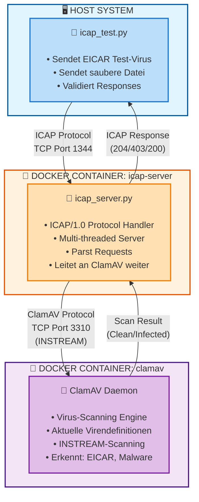

# Docker Test-Umgebung für ICAP

Diese Docker-Compose-Umgebung stellt einen vollständigen ICAP-Server mit ClamAV bereit, um das ICAP-Test-Skript zu testen.

## 🏗️ Komponenten

- **ClamAV** (Port 3310) - Antivirus-Engine mit Auto-Updates
- **Python ICAP-Server** (Port 1344) - Leichtgewichtiger ICAP-Server

## Voraussetzungen

```bash
# Docker und Docker Compose installieren
sudo apt-get update
sudo apt-get install docker.io docker-compose

# Benutzer zur docker-Gruppe hinzufügen
sudo usermod -aG docker $USER
# Neu anmelden oder: newgrp docker
```

> **💡 Hinweis:** Je nach Docker-Installation verwenden Sie entweder `docker compose` (neue Version, Plugin) oder `docker-compose` (alte standalone Version). Beide Befehle werden in dieser Dokumentation gezeigt.

## 🚀 Verwendung

### 1. Umgebung starten

```bash
# Container bauen und starten
docker compose up -d
# oder: docker-compose up -d

# Logs verfolgen
docker compose logs -f
# oder: docker-compose logs -f
```

**Wichtig**: Beim ersten Start lädt ClamAV die Virendefinitionen herunter. Dies kann 5-10 Minuten dauern!

### 2. Status prüfen

```bash
# Container-Status
docker compose ps
# oder: docker-compose ps

# ClamAV-Status
docker exec clamav clamdscan --version

# ICAP-Server-Status
docker exec icap-server ps aux | grep python
```

### 3. Test-Skript ausführen

```bash
# Basis-Test
python3 icap_test.py --host localhost --port 1344 --service avscan

# Mit allen Optionen
python3 icap_test.py --host localhost --port 1344 --service avscan --test-options --verbose
```

### 4. Umgebung stoppen

```bash
# Container stoppen
docker compose down
# oder: docker-compose down

# Container stoppen und Volumes löschen
docker compose down -v
# oder: docker-compose down -v
```

## ❗ Fehlerbehebung

### ClamAV lädt Definitionen

```bash
# ClamAV-Logs prüfen
docker compose logs clamav
# oder: docker-compose logs clamav

# Warten bis "clamd is ready" erscheint
docker compose logs -f clamav | grep "clamd is ready"
# oder: docker-compose logs -f clamav | grep "clamd is ready"
```

### ICAP-Server antwortet nicht

```bash
# ICAP-Server-Logs prüfen
docker compose logs icap-server
# oder: docker-compose logs icap-server

# Manueller Test
echo -e "OPTIONS icap://localhost:1344/avscan ICAP/1.0\r\nHost: localhost\r\n\r\n" | nc localhost 1344
```

### Container neu bauen

```bash
# Bei Konfigurationsänderungen
docker compose down
docker compose build --no-cache
docker compose up -d

# oder mit alter Syntax:
# docker-compose down
# docker-compose build --no-cache
# docker-compose up -d
```

## 🏛️ Architektur



### 📊 Dateifluss

1. **icap_test.py** → Sendet ICAP Request mit Testdatei (EICAR oder Clean)
2. **icap_server.py** → Empfängt Request, extrahiert Datei-Content
3. **icap_server.py** → Sendet Datei-Bytes an ClamAV via INSTREAM
4. **ClamAV** → Scannt Datei mit aktuellen Virendefinitionen
5. **ClamAV** → Gibt Ergebnis zurück (FOUND/OK)
6. **icap_server.py** → Erstellt ICAP Response basierend auf Scan-Result
7. **icap_test.py** → Empfängt & validiert Response

### 🏷️ Response-Codes

| Code | Bedeutung | Beschreibung |
|------|-----------|--------------|
| ✅ `ICAP/1.0 204` | No Modifications Needed | Datei ist sauber |
| ⛔ `ICAP/1.0 403` | Forbidden | Virus gefunden, Zugriff verweigert |
| ℹ️ `ICAP/1.0 200` | OK | OPTIONS Request erfolgreich |

## ⚙️ Erweiterte Konfiguration

### ClamAV-Konfiguration anpassen

Bearbeite `docker-compose.yml` und füge Environment-Variablen hinzu:

```yaml
environment:
  - CLAMAV_NO_FRESHCLAM=false  # Automatische Updates
  - CLAMD_STARTUP_TIMEOUT=1800 # Timeout für Start
```

### Python ICAP-Server anpassen

Bearbeite [icap_server.py](icap_server.py) und starte neu:

```bash
docker compose restart icap-server
docker compose logs -f icap-server

# oder: docker-compose restart icap-server
# oder: docker-compose logs -f icap-server
```

### Debug-Modus aktivieren

In [icap_server.py](icap_server.py):
```python
logging.basicConfig(
    level=logging.DEBUG,  # Mehr Details
    format='%(asctime)s - %(name)s - %(levelname)s - %(message)s'
)
```

## Port-Anpassungen

Fal🔧 ls die Standard-Ports belegt sind:

```yaml
services:
  icap-server:
    ports:
      - "11344:1344"  # Host:Container
```

Dann Skript aufrufen mit:
```bash
python3 icap_test.py --host localhost --port 11344 --service avscan
```

## Persistenz

Die💾  ClamAV-Virendefinitionen werden in einem Docker-Volume gespeichert:

```bash
# Volume anzeigen
docker volume ls | grep clamav

# Volume entfernen (löscht Definitionen!)
docker volume rm icap-test-script_clamav-data
```

## ⚡ Performance-Tipps

- Erster Start dauert lange (Virendefinitionen laden)
- Nachfolgende Starts sind schnell (Definitionen gecached)
- Volume nicht löschen für schnellere Neustarts

## 🔍 Service-Alternativen

Der Python-ICAP-Server unterstützt verschiedene Service-Pfade:

```bash
# Standard AV-Scan Service
python3 icap_test.py --service avscan

# Jeder Pfad funktioniert (Server ist flexibel)
python3 icap_test.py --service scan
python3 icap_test.py --service check
```

## 📋 Logs

```bash
# Alle Logs
docker compose logs
# oder: docker-compose logs

# Nur ICAP-Server
docker compose logs icap-server
# oder: docker-compose logs icap-server

# Nur ClamAV
docker compose logs clamav
# oder: docker-compose logs clamav

# Live-Logs folgen
docker compose logs -f
# oder: docker-compose logs -f
```
