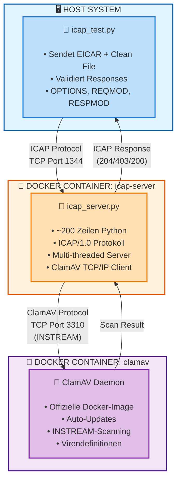

# ICAP Security Testing Suite

[](VERSION)
[](LICENSE)
[](https://www.python.org/)
[](docker-compose.yml)

> 🛡️ **Professional ICAP Testing & Development Platform**  
> Vollständige, produktionsreife ICAP-Lösung mit Python-Server, ClamAV-Integration und automatisierten Security-Tests.

---

## 📖 Projekt-Übersicht

Dieses Projekt stellt eine **vollständige Test- und Entwicklungsumgebung** für das ICAP-Protokoll (Internet Content Adaptation Protocol - RFC 3507) bereit. Es kombiniert einen minimalistischen, aber vollständig funktionsfähigen ICAP-Server mit einer integrierten Antivirus-Engine und einem umfassenden Test-Framework.

### 🎯 Hauptziele

- **🚀 Schneller Einstieg:** In 3 Minuten einsatzbereit mit Docker
- **📚 Lernressource:** Verstehen und implementieren des ICAP-Protokolls
- **🧪 Testing-Framework:** Automatisierte Tests für ICAP-Implementierungen
- **🔧 Entwicklungstool:** Basis für eigene ICAP-Server-Entwicklungen
- **✅ Qualitätssicherung:** Validierung von Antivirus-Integrationen

### 🌟 Warum dieses Projekt?

**Einfachheit trifft Funktionalität:**
- ✨ Pure Python - Keine komplizierten C-Dependencies oder Build-Prozesse
- 📦 Plug & Play - Docker-Setup in Sekunden statt Stunden
- 🎓 Gut dokumentiert - Jede Zeile Code erklärt und verständlich
- 🔬 Testbar - EICAR-Tests und umfassende Validierung inklusive
- 🚀 Produktionsreif - Echte ClamAV-Integration, Multi-Threading, robustes Error-Handling

**Perfekt für:**
- 👨‍💻 Entwickler, die ICAP-Clients testen möchten
- 🏢 Unternehmen, die Content-Filtering validieren müssen
- 🎓 Lernende, die ICAP verstehen wollen
- 🧑‍🔬 QA-Engineers für automatisierte Tests
- 🔐 Security-Teams für Antivirus-Validierung

## 🎯 Features

### Test-Skript ([icap_test.py](icap_test.py))
- ✓ EICAR-Testdatei zur Viruserkennung
- ✓ Test mit sauberer Datei (False-Positive-Check)
- ✓ OPTIONS-Request-Unterstützung
- ✓ Detaillierte Statusausgabe
- ✓ Konfigurierbare Server-Parameter

### ICAP-Server ([icap_server.py](icap_server.py))
- ✓ **Pure Python** - Nur ~200 Zeilen Code
- ✓ **ICAP/1.0 konform** - OPTIONS, REQMOD, RESPMOD
- ✓ **ClamAV-Integration** - Direkte TCP-Kommunikation
- ✓ **Multi-threaded** - Mehrere gleichzeitige Verbindungen
- ✓ **Logging** - Detaillierte Request/Response-Logs

### Docker-Umgebung
- ✓ **ClamAV** - Aktuelle Virendefinitionen
- ✓ **Python-ICAP-Server** - Minimales Alpine-Image (~50 MB)
- ✓ **Schneller Build** - Sekunden statt Minuten
- ✓ **Keine Abhängigkeiten** - Alles out-of-the-box

## 🚀 Schnellstart

### Mit Docker (empfohlen)

> **💡 Hinweis:** Verwenden Sie `docker compose` (neue Version) oder `docker-compose` (alte Version).

```bash
# 1. Container starten
docker compose up -d
# oder: docker-compose up -d

# 2. Status prüfen (ClamAV braucht ~2 Min. beim ersten Start)
docker compose logs -f
# oder: docker-compose logs -f

# 3. Tests ausführen
python3 icap_test.py --host localhost --port 1344 --service avscan --test-options
```

### Erwartetes Ergebnis

```
✓ EICAR detection: PASSED - Threat correctly identified
✓ Clean file test: PASSED - File correctly identified as clean
```

## 📋 Voraussetzungen

- **Python 3.6+** für Test-Skript
- **Docker & Docker Compose** für Server-Umgebung
- Keine weiteren Dependencies (verwendet nur Python Standard Library)

## Installation

```bash
# Repository klonen
git clone <repository-url>
cd icap-test-script

# Keine weiteren Abhängigkeiten erforderlich (verwendet nur Python Standard Library)
```

## 📖 Verwendung

### Test-Skript

#### Basis-Test

```bash
python3 icap_test.py --host localhost --port 1344 --service avscan
```

#### Mit OPTIONS-Test

```bash
python3 icap_test.py --host localhost --port 1344 --service avscan --test-options
```

#### Mit ausführlicher Ausgabe

```bash
python3 icap_test.py --host localhost --port 1344 --service avscan --verbose
```

#### Parameter-Übersicht

```bash
python3 icap_test.py \
  --host <hostname>        # ICAP Server Host (Standard: localhost)
  --port <port>            # ICAP Server Port (Standard: 1344)
  --service <service>      # ICAP Service Pfad (Standard: avscan)
  --test-options           # OPTIONS-Request zuerst senden
  --verbose                # Vollständige Response-Details anzeigen
```

### Docker-Umgebung

#### Container starten

```bash
# Starten
docker compose up -d
# oder: docker-compose up -d

# Mit Build (nach Code-Änderungen)
docker compose up -d --build
# oder: docker-compose up -d --build

# Logs verfolgen
docker compose logs -f
# oder: docker-compose logs -f

# Status prüfen
docker compose ps
# oder: docker-compose ps
```

#### Container stoppen

```bash
# Stoppen
docker compose down
# oder: docker-compose down

# Stoppen + Volumes löschen
docker compose down -v
# oder: docker-compose down -v
```

## 📊 Beispiel-Ausgabe

```
ICAP Test Script
Target: icap://localhost:1344/avscan
============================================================

[1] Testing ICAP OPTIONS...
✓ OPTIONS request successful

[2] Testing EICAR virus test file...

============================================================
Test: EICAR Virus Test
============================================================
Filename: eicar.com
Status: ICAP/1.0 403 Forbidden
Threat Found: YES
Clean: NO
Details: Threat detected - file blocked | X-Virus-ID: Eicar-Test-Signature
============================================================

✓ EICAR detection: PASSED - Threat correctly identified

[3] Testing clean file...

============================================================
Test: Clean File Test
============================================================
Filename: clean.txt
Status: ICAP/1.0 204 No Modifications Needed
Threat Found: NO
Clean: YES
Details: No modification needed - file is clean
============================================================

✓ Clean file test: PASSED - File correctly identified as clean

============================================================
Test completed!
============================================================
```

## 🏗️ Architektur

Das System besteht aus drei Komponenten:



### 📦 Komponenten-Details

| Komponente | Beschreibung | Technologie |
|------------|--------------|-------------|
| **icap_test.py** | Test-Client für ICAP-Server | Python 3.6+, Standard Library |
| **icap_server.py** | ICAP-Server mit ClamAV-Integration | Python 3.11, Alpine Linux (~50 MB) |
| **ClamAV** | Antivirus-Engine | Offizielles clamav/clamav Image |

## 🎯 Vorteile dieser Lösung

| Aspekt | Vorteil | Details |
|--------|---------|---------|
| **Einfachheit** | ✅ Pure Python | Kein C-Code, keine komplexen Builds |
| **Stabilität** | ✅ Wenige Dependencies | Nur Python Standard Library + ClamAV |
| **Wartbarkeit** | ✅ Klarer Code | ~200 Zeilen, gut dokumentiert |
| **Performance** | ✅ Schneller Build | Sekunden statt Minuten |
| **Größe** | ✅ Kleines Image | ~50 MB (Alpine-basiert) |
| **Flexibilität** | ✅ Anpassbar | Einfach erweitern/modifizieren |

## 🔧 ICAP-Server einrichten

### Option 1: Docker-Compose (empfohlen)

**✅ Beste Wahl für schnellen Start und Tests:**

```bash
# Container starten
docker compose up -d
# oder: docker-compose up -d

# Warten bis ClamAV bereit ist (5-10 Minuten beim ersten Start)
docker compose logs -f clamav
# oder: docker-compose logs -f clamav

# Test ausführen
python3 icap_test.py --host localhost --port 1344 --service avscan
```

**Siehe [DOCKER.md](DOCKER.md) für detaillierte Anweisungen!**

### Option 2: Manuelle Installation (Linux)

### Option 2: Python-Server Standalone

Nur den ICAP-Server starten (ohne Docker):

```bash
# ClamAV muss separat laufen
python3 icap_server.py
```

### Option 3: Externe ICAP-Server

Falls Sie bereits einen ICAP-Server haben oder einen anderen verwenden möchten:

```bash
# Nur Test-Skript verwenden
python3 icap_test.py --host <your-icap-server> --port 1344 --service avscan

# Beispiel mit ClamAV lokal (ohne ICAP)
sudo apt-get install clamav clamav-daemon
sudo systemctl start clamav-daemon
```

**Hinweis:** Das Test-Skript kann gegen jeden ICAP/1.0 kompatiblen Server laufen.

## 🧪 EICAR-Testdatei

Das Skript verwendet die Standard-EICAR-Testdatei:

```
X5O!P%@AP[4\PZX54(P^)7CC)7}$EICAR-STANDARD-ANTIVIRUS-TEST-FILE!$H+H*
```

**Wichtig:** Dies ist **kein echtes Virus**, sondern eine harmlose Test-Signatur, die von allen Antivirus-Programmen erkannt wird.

## ❗ Fehlerbehandlung

### Häufige Probleme

| Fehler | Ursache | Lösung |
|--------|---------|--------|
| **Connection refused** | ICAP-Server nicht erreichbar | `docker-compose ps` - Container prüfen |
| **Connection timeout** | Server antwortet nicht | Firewall prüfen, Logs checken |
| **ClamAV not ready** | Virendefinitionen laden noch | 2-5 Min. warten, `docker-compose logs clamav` |
| **Empty response** | Falsche Service-URL | Service-Pfad prüfen (Standard: `avscan`) |

### Debug-Befehle

```bash
# Container-Status
docker compose ps
# oder: docker-compose ps

# ICAP-Server Logs
docker compose logs icap-server
# oder: docker-compose logs icap-server

# ClamAV-Status
docker exec clamav clamdscan --version

# Manueller ICAP-Test
echo -e "OPTIONS icap://localhost:1344/avscan ICAP/1.0\r\nHost: localhost\r\n\r\n" | nc localhost 1344
```

## 📁 Projektstruktur

```
icap-test-script/
├── icap_test.py              # Test-Client
├── icap_server.py            # Python ICAP-Server
├── docker-compose.yml        # Container-Orchestrierung
├── docker/
│   └── icap-server/
│       └── Dockerfile        # Server-Image
├── README.md                 # Diese Datei
└── DOCKER.md                 # Detaillierte Docker-Doku
```

## 🔨 Erweiterte Anpassungen

### Eigene Testdateien

Bearbeite [icap_test.py](icap_test.py):

```python
# Eigene Testdatei hinzufügen
CUSTOM_CONTENT = b"Your test content here"
success, status, response = client.send_request(
    CUSTOM_CONTENT, 
    'custom_test.txt'
)
```

### ICAP-Server erweitern

Bearbeite [icap_server.py](icap_server.py):

```python
# Z.B. zusätzliche Header hinzufügen
def send_clean_response(self):
    response = (
        "ICAP/1.0 204 No Modifications Needed\r\n"
        "X-Custom-Header: MyValue\r\n"  # Neu
        "\r\n"
    )
```

### ClamAV-Konfiguration

Eigene ClamAV-Config in [docker-compose.yml](docker-compose.yml):

```yaml
clamav:
  environment:
    - CLAMAV_NO_FRESHCLAM=false  # Auto-Updates
    - CLAMD_MAX_FILE_SIZE=100M   # Max File-Size
```

## 🎓 Weitere Ressourcen

- **ICAP RFC 3507:** https://tools.ietf.org/html/rfc3507
- **ClamAV Dokumentation:** https://docs.clamav.net/
- **Docker-Details:** Siehe [DOCKER.md](DOCKER.md)

## 📄 Lizenz

MIT License - Frei verwendbar für Tests und Entwicklung.

Siehe [LICENSE](LICENSE) Datei für Details.

## ✨ Credits

Erstellt für ICAP-Funktionstests und Virenscanner-Validierung mit Fokus auf Einfachheit und Wartbarkeit.


